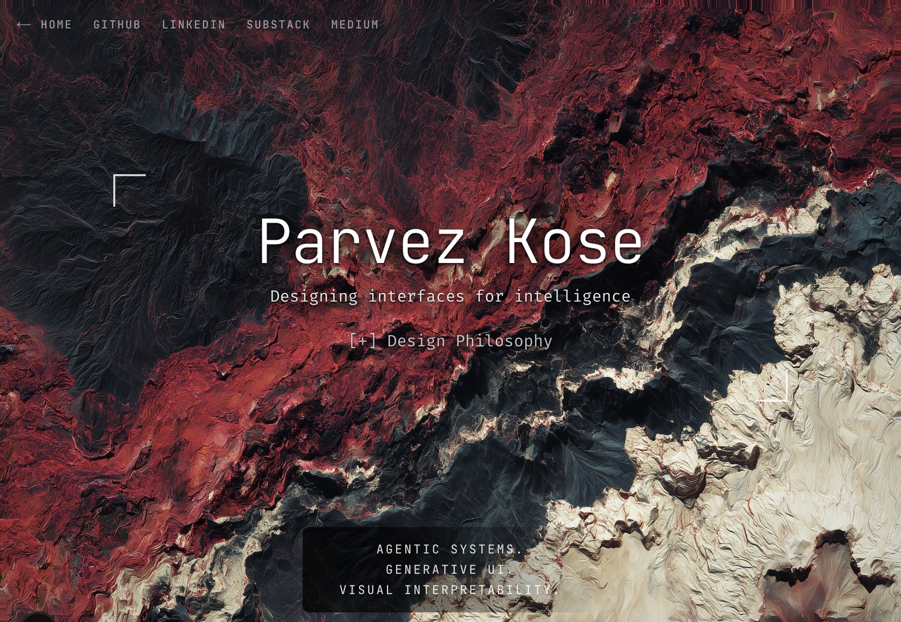

# parvezkose.com

Agentic interfaces, generative UI, design–engineering.

→ [parvezkose.com](https://parvezkose.com)

---

## Design philosophy

> I build AI-augmented interfaces and agentic systems with a deliberate break from generic SaaS design: craft rooted in culture and material honesty.
>
> Visual interpretability shapes how I build. I'm drawn to what lives under the surface and what the model is actually doing. And I think the people using it should too.

The site argues against the visual homogeneity of the modern web — the same rounded cards, neutral palettes, safe sans-serifs, blurred gradients, glowing accents. The counter-move is one strong signature (an immersive WebGL terrain) and quiet structure around it. *Poetry in the shell, rigor in the stack.*

## Stack

Next.js 15 (App Router) · React 19 · Tailwind v4 alpha · WebGL2 · MDX.

## Design system

Tokens and component specimens live in [`design-system/`](./design-system) and at [`parvezkose.com/design-system`](https://parvezkose.com/design-system/). Added via a separate PR.

## Writing

[Design Logic — Substack](https://designlogic.substack.com) · [DeepViz — Medium](https://medium.com/deepviz)
